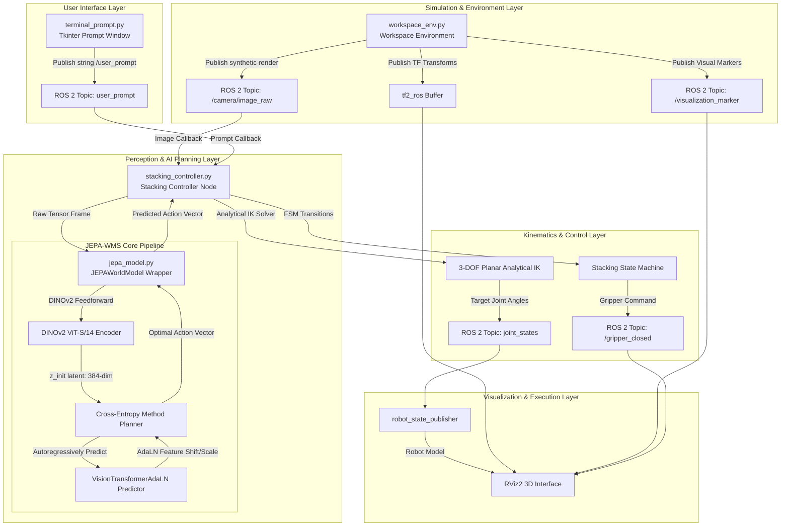
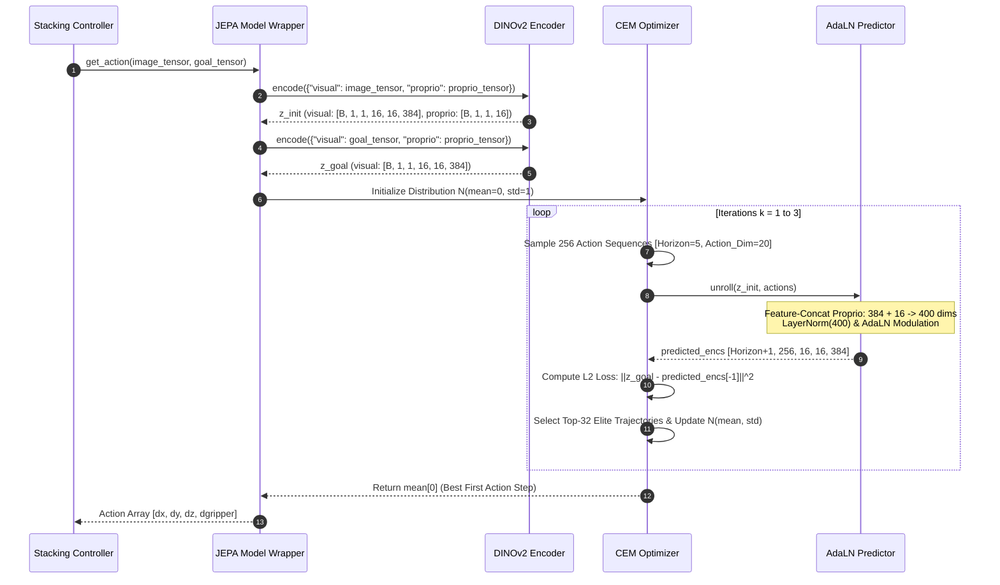
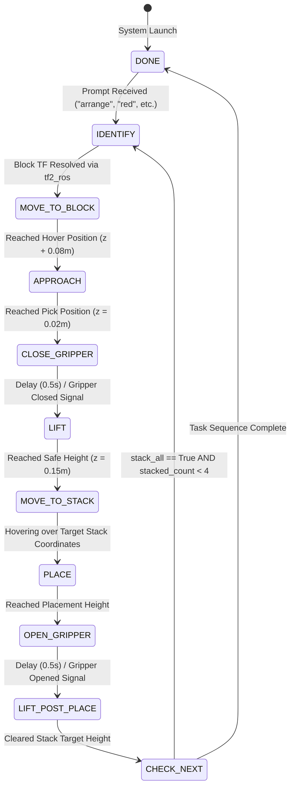

# WorldXD: Closed-Loop Visual World Model Simulation & Robotic Arm Control

[](https://www.python.org/downloads/release/python-3120/)
[](https://pytorch.org/)
[](https://docs.ros.org/)
[](https://github.com/facebookresearch/jepa-wms)
[](https://developer.apple.com/metal/pytorch/)
[](https://pixi.sh)

**WorldXD** is an advanced, real-time robotic arm simulation platform powered by **Meta’s Joint Embedding Predictive Architecture for World Models in Simulation (JEPA-WMS)**. Designed to run natively on Apple Silicon (MPS backend), WorldXD couples high-level visual planning in abstract feature space with low-level analytical inverse kinematics (IK) and finite state machine control for target manipulation.

The system continuously captures top-down visual feedback, projects target goals into DINOv2 latent space, synthesizes control trajectories using Cross-Entropy Method (CEM) stochastic planning, and drives an **EEZYbotARM MK2** 4-DOF manipulator within a ROS 2 / RViz environment.

---

## Table of Contents

- [WorldXD: Closed-Loop Visual World Model Simulation \& Robotic Arm Control](#worldxd-closed-loop-visual-world-model-simulation--robotic-arm-control)
  - [Table of Contents](#table-of-contents)
  - [System Architecture](#system-architecture)
    - [1. Full Subsystem Topology](#1-full-subsystem-topology)
    - [2. JEPA Latent Space CEM Planning Loop](#2-jepa-latent-space-cem-planning-loop)
    - [3. Stacking Controller State Machine (FSM)](#3-stacking-controller-state-machine-fsm)
  - [Theoretical \& Mathematical Foundations](#theoretical--mathematical-foundations)
    - [1. Joint Embedding Latent Distance Minimization](#1-joint-embedding-latent-distance-minimization)
    - [2. Cross-Entropy Method (CEM) Optimization](#2-cross-entropy-method-cem-optimization)
    - [3. Analytical Inverse Kinematics (EEZYbotARM MK2)](#3-analytical-inverse-kinematics-eezybotarm-mk2)
  - [Neural Architecture Specs](#neural-architecture-specs)
  - [Repository Structure](#repository-structure)
  - [Installation \& Environment Setup](#installation--environment-setup)
    - [Prerequisites](#prerequisites)
    - [1. Clone Repository](#1-clone-repository)
    - [2. Environment Initialization via Pixi](#2-environment-initialization-via-pixi)
  - [Execution \& Operation](#execution--operation)
    - [1. Master Simulation Launch](#1-master-simulation-launch)
    - [2. Isolated Model Verification](#2-isolated-model-verification)
    - [3. Natural Language Interface Commands](#3-natural-language-interface-commands)
  - [Debugging \& Troubleshooting](#debugging--troubleshooting)
    - [1. Tensor Dimension Alignment (384 vs 400 Dims)](#1-tensor-dimension-alignment-384-vs-400-dims)
    - [2. PyTorch MPS Memory Allocation](#2-pytorch-mps-memory-allocation)
  - [License \& Acknowledgments](#license--acknowledgments)

---

## System Architecture

WorldXD relies on a distributed multi-node architecture communicating asynchronously over ROS 2 topics and inter-process streams.

### 1. Full Subsystem Topology



---

### 2. JEPA Latent Space CEM Planning Loop

Instead of decoding latent features back into high-dimensional pixel arrays (e.g. VAEs/Diffusion), JEPA computes loss and predictions directly within the latent representation space $\mathcal{Z}$.



---

### 3. Stacking Controller State Machine (FSM)



---

## Theoretical & Mathematical Foundations

### 1. Joint Embedding Latent Distance Minimization

Given an initial context frame observation $o_t$ and a goal condition observation $o_g$, the visual encoder $E_\phi$ projects images to normalized embedding vectors:

$$z_t = E_\phi(o_t), \quad z_g = E_\phi(o_g) \quad \text{where } z_t, z_g \in \mathbb{R}^{B \times 1 \times 16 \times 16 \times 384}$$

Proprioception inputs $p_t \in \mathbb{R}^{B \times 1 \times 4}$ are mapped through linear projection $P_\psi(p_t) \in \mathbb{R}^{B \times 1 \times 16}$ and concatenated along feature dimension:

$$x_t = \text{Concat}\left(z_t, P_\psi(p_t)\right) \in \mathbb{R}^{B \times 256 \times 400}$$

### 2. Cross-Entropy Method (CEM) Optimization

The CEM algorithm optimizes the action sequence matrix $\mathbf{A} \in \mathbb{R}^{H \times A}$ over horizon $H=5$ with action dimension $A=20$ (4 raw actions $\times$ frameskip of 5):

$$\mathbf{A}^{(k)} \sim \mathcal{N}\left(\boldsymbol{\mu}^{(k)}, \boldsymbol{\Sigma}^{(k)}\right), \quad \text{for } i=1 \dots K \text{ samples } (K=256)$$

The rollouts are evaluated against the target goal embedding using $L_2$ visual distance:

$$\mathcal{J}(\mathbf{A}_i) = \frac{1}{M} \sum_{m=1}^{M} \left\| z_{g,m} - \hat{z}_{t+H, m}^{(i)} \right\|_2^2$$

Elite actions selection and parameter updates:

$$\mathcal{E} = \text{TopK}\left(-\mathcal{J}(\mathbf{A}_1), \dots, -\mathcal{J}(\mathbf{A}_K); E=32\right)$$

$$\boldsymbol{\mu}^{(k+1)} = \frac{1}{E} \sum_{e \in \mathcal{E}} \mathbf{A}_e, \quad \boldsymbol{\Sigma}^{(k+1)} = \text{diag}\left( \frac{1}{E} \sum_{e \in \mathcal{E}} (\mathbf{A}_e - \boldsymbol{\mu}^{(k+1)})^2 \right)$$

### 3. Analytical Inverse Kinematics (EEZYbotARM MK2)

The 4-DOF manipulator link dimensions are:
- $l_1 = 0.134\,\text{m}$ (Upper Arm)
- $l_2 = 0.120\,\text{m}$ (Forearm)
- $z_{\text{base}} = 0.078\,\text{m}$ (Base Elevation)

For desired end-effector spatial coordinates $(x, y, z)$:

$$\theta_1 = \text{atan2}(y, x)$$

$$r = \sqrt{x^2 + y^2}, \quad z_{\text{rel}} = z - z_{\text{base}}, \quad d = \sqrt{r^2 + z_{\text{rel}}^2}$$

Applying the Law of Cosines for elbow angle $\theta_3$:

$$\cos\theta_3 = \frac{d^2 - l_1^2 - l_2^2}{2 l_1 l_2}, \quad \theta_3 = -\text{atan2}\left(\sqrt{1 - \cos^2\theta_3}, \cos\theta_3\right)$$

For shoulder elevation angle $\theta_2$:

$$\beta = \text{atan2}(z_{\text{rel}}, r), \quad \gamma = \text{atan2}\left(l_2 \sin\theta_3, l_1 + l_2 \cos\theta_3\right), \quad \theta_2 = -(\beta - \gamma)$$

Parallel link orientation constraint:

$$\theta_4 = -(\theta_2 + \theta_3)$$

---

## Neural Architecture Specs

```
EncPredWM Model
│
├── Visual Encoder: DinoEncoder (DINOv2 ViT-S/14)
│   ├── Parameters: 22,056,576 (Frozen)
│   ├── Patch Size: 14x14
│   ├── Feature Dim: 384
│   └── Output Tokens: 16x16 = 256 patches
│
├── Action Encoder: Linear(20 -> 400)
├── Proprio Encoder: Linear(4 -> 16)
│
└── Predictor: VisionTransformerAdaLN
    ├── Parameters: 17,630,480 (Trainable)
    ├── Blocks: 6 x FWAdaLNBlock
    ├── Embed Dim: 384 (Visual) + 16 (Proprio) = 400 Total
    ├── Modulation: SiLU -> Linear(400 -> 2400) [6 x 400 for Shift/Scale/Gate]
    ├── Attention: RoPE (Rotary Position Embeddings)
    └── Output Projection: Linear(400 -> 384)
```

---

## Repository Structure

```
WorldXD/
├── launch_robot.py             # Master entrypoint launching ROS 2, RViz2, & nodes
├── stacking_controller.py      # ROS 2 node executing IK, FSM, and JEPA callbacks
├── jepa_model.py               # Torch wrapper implementing Meta JEPA-WMS & CEM Planner
├── workspace_env.py            # Environment node publishing TFs, markers, and camera frames
├── terminal_prompt.py          # Tkinter natural language user interface window
├── test_jepa.py                # Standalone verification script for JEPA model pipeline
├── ik_interactive_tracker.py   # Standalone interactive IK solver visualizer
├── pixi.toml                   # Pixi environment configuration & system dependencies
├── pixi.lock                   # Lockfile pinning reproducible dependencies
├── robot_description/          # Robot mesh assets and URDF descriptions
│   ├── urdf/eezybotarm.urdf    # Kinematic URDF definition
│   └── rviz/config.rviz        # Preserved RViz visualization layout
└── jepa-wms/                   # Submodule repository containing Meta JEPA-WMS source
```

---

## Installation & Environment Setup

### Prerequisites
- macOS Apple Silicon (M1/M2/M3/M4) recommended for MPS GPU acceleration.
- [Pixi Package Manager](https://pixi.sh):
  ```bash
  curl -fsSL https://pixi.sh/install.sh | bash
  ```

### 1. Clone Repository

```bash
git clone https://github.com/Ojas-sta/WorldXD.git
cd WorldXD
```

### 2. Environment Initialization via Pixi

Pixi automatically installs Python 3.12, PyTorch with MPS support, ROS 2 libraries, OpenCV, and Tensordict without requiring system-level ROS 2 installations:

```bash
pixi install
```

---

## Execution & Operation

### 1. Master Simulation Launch

To launch the complete visual control loop, URDF state publisher, workspace environment, RViz2 3D viewer, and prompt interface in a single command:

```bash
pixi run python3 launch_robot.py
```

### 2. Isolated Model Verification

To verify that the JEPA-WMS checkpoint and CEM planner pass forward tensors cleanly without launching ROS 2:

```bash
pixi run python3 test_jepa.py
```

### 3. Natural Language Interface Commands

Once the simulation prompt window launches, submit any of the following natural language targets:

| Command | Action Executed |
| :--- | :--- |
| `stack the red box` | Identifies `block_0`, executes pick & place onto target stack |
| `stack the green box` | Identifies `block_1`, moves to stack position |
| `stack the blue box` | Identifies `block_2`, moves to stack position |
| `stack the yellow box` | Identifies `block_3`, moves to stack position |
| `arrange all boxes` | Triggers sequential loop stacking all 4 blocks in sequence |
| `reset stack` | Clears state machine and resets internal stack count to 0 |

---

## Debugging & Troubleshooting

### 1. Tensor Dimension Alignment (384 vs 400 Dims)

If modifying model unrolling or tensor preparation, ensure proprioceptive inputs are included in the dictionary passed to `unroll()`:

```python
# CORRECT: Retains proprio features required for 400-dim LayerNorm
z_init = {"visual": visual_tensor, "proprio": proprio_tensor}
predicted_encs = self.model.unroll(z_init, act_suffix=actions)
```

Passing visual features alone bypasses feature concatenation, causing `LayerNorm((400,))` to fail on 384-dimensional activations.

### 2. PyTorch MPS Memory Allocation

The model loads initial weights on CPU before transferring to `mps` using `torch.float16` to maintain a memory footprint below 3.5 GB:

```python
self.model = self.model.to(torch.device("mps"), dtype=torch.float16)
```

---

## License & Acknowledgments

- **JEPA-WMS**: Developed by Meta AI Research ([facebookresearch/jepa-wms](https://github.com/facebookresearch/jepa-wms)).
- **DINOv2**: Vision Transformer backbones by Meta AI.
- **EEZYbotARM MK2**: Open source 3D-printable robotic arm design by dauno.
